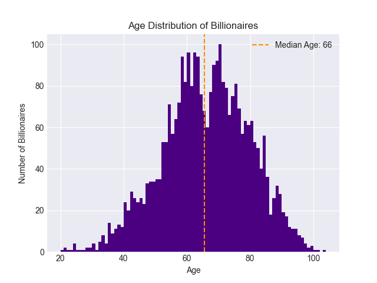
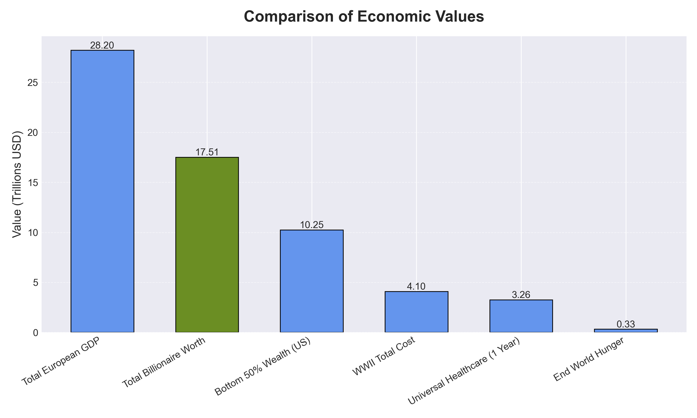

# Billionaires Can End World Hunger 50 Times Over!

#### April 28, 2026

## Comprehending Wealth

It's no secret that wealth is disproportionately concentrated across our society. Amazingly, a small subset of just over 3,000 individuals holds more wealth than the bottom 50% of the United States. Simply imagine all the things this amount of wealth can do for the world.

## The Issue with Wealth Disparity

Wealth disparity is sometimes considered to be one of the most divisive and systemically problematic issues affecting the world. In recent history, wealth disparity has reached its widest gap ever, with the top 1% of households holding over 30% of wealth while the bottom 50% hold just 2.5%. This trend in diverging wealth concentration is largely due to corporate stock ownership, where the investments of the wealthy have only fueled their wealth to greater extents. This has created a phenomenon where the middle class is actually shrinking, while the gap between the upper class and lower class is growing. 

When wealth disparity increases, economic and social mobility decrease. It hinders opportunities for lower class individuals to accumulate wealth. The wealthiest individuals also gain more political power, which allows many to exert influence in favor of maintaining their wealth and thus creating a cycle of power and wealth. Overall, increased wealth inequality weakens the democratic ideals of our society. This issue can also be tied to racial problems, distrust in government, and increased political polarization.

Additionally, much discourse exists about whether billionaires should be allowed to exist or not. Many advocates in support of billionaires draw attention to the benefits they bring for the economy. Wealth trickles down from the ultrawealthy to the working class populations. Additionally billionaires are some of the largest investors, and they have funded the growth of the most successful but also beneficial companies for society. Many experts cite profound economic growth to our economic model and the incentive to accumulate such levels of wealth. Under these controversial circumstances, there is plenty of disagreement that has emerged about whether billionaire status should fundamentally be attainable.

## Analyzing the Billionaire Population

Keeping the core ideas above in mind, it is important to explore how and why wealth accumulates where it does. Referencing the Forbes World's Billionaires Ranking, the following analytics were produced to better understand how billionaires are distributed as a population themselves, and how their population relates in comparison with the general population. As of August 2025 there were over 3,100 billionaires in the world. This number has increased by several hundred since then. From this population, roughly 87% are male and 13% are female. The largest percentage of these billionaires hail from the United States (29%), followed by China (16%) and India (7%). The median age of billionaires is 66 years old, which is far greater than the US median age of 39 years and the global median age of 31 years. The remaining billionaires are dispersed across the globe, though a high concentration are from Europe and East Asia. Analyzing the industries where these billionaires acquired their wealth, the greatest percentage achieved their status through finance and investments. After that, the tech industry has produced the greatest amount of billionaires.

**Figure 1.** Age Distribution of Billionaires

Even among billionaires themselves, the wealth held by these individuals is modeled by exponential growth. The title of centibillionaire, or an individual with a net worth of at least $100 billion, is limited to only 20 individuals in the entire world. This very small group holds a level of wealth that is even incomparable to "typical" billionaires. Put all together, the accumulated wealth of these 3,000+ billionaires stands at 17.5 trillion dollars (as of 2025; since then, the estimated value has increased to over $20 trillion). To even comprehend a value this large, the chart below demonstrates what can be accomplished on this relative magnitude of wealth.

## Economic Comparison with Billionaires

**Figure 2.** Economic Comparison with Billionaires

As is seen in this chart, billionaire wealth, when aggregated as a whole, stands greater than the GDP of most large developed countries. It is significantly greater than the total cost of World War II, even after adjusting for inflation. It exceeds the wealth of the bottom 50% of the United States population. And it has the ability to eradicate world hunger, 50 times over.
